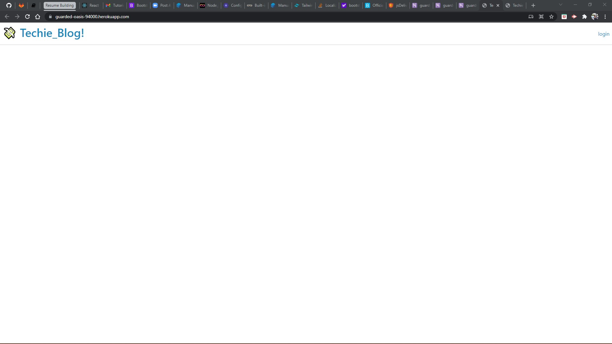

# Project_Title

TECHIE_BLOG
## Description:
Techie_Blog is a fullstack web application that allows developers to publish their blog posts and comment on other developers’ posts as well.

### Table of Contents

_[Project_Title](#project_title)
_[Desciption](#description)
_[Contributors](#contributors)
_[Packages](#packages)
\_[Media](#media)

### Contributors

Alfonso Robles

#### Packages

- [Npm mysql2] 
- [Npm Sequelize] 
- [Npm dotenv] 
- [Npm express-handlebars] 
- [Npm bcrypt] 
- [Npm express-session]
- [Npm connect-session-sequelize]

#### Media

